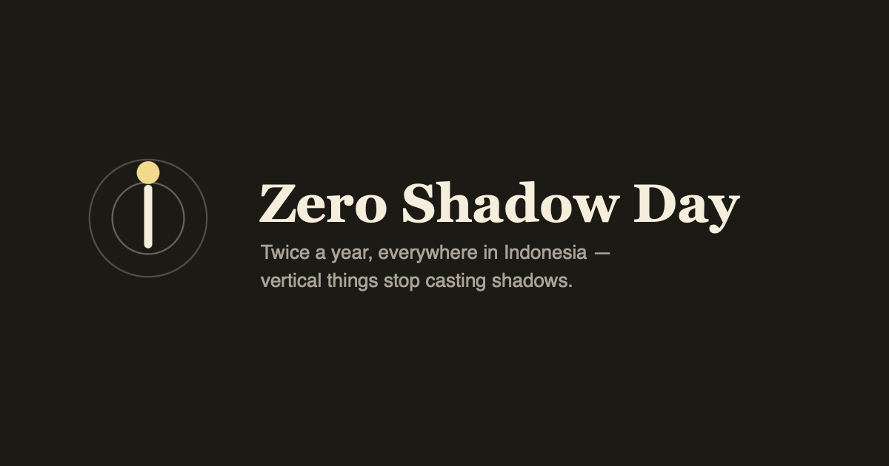
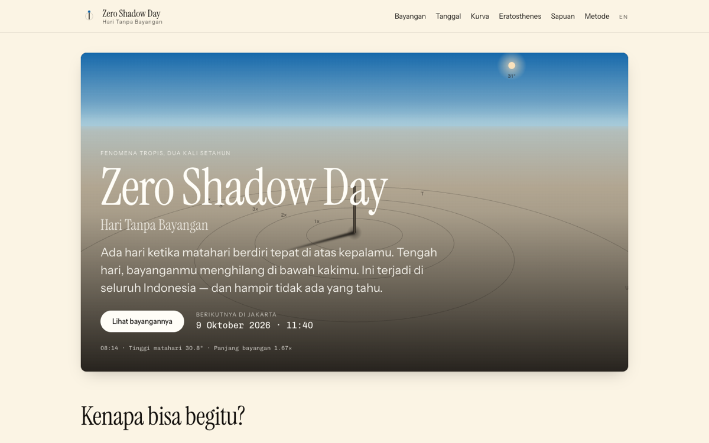
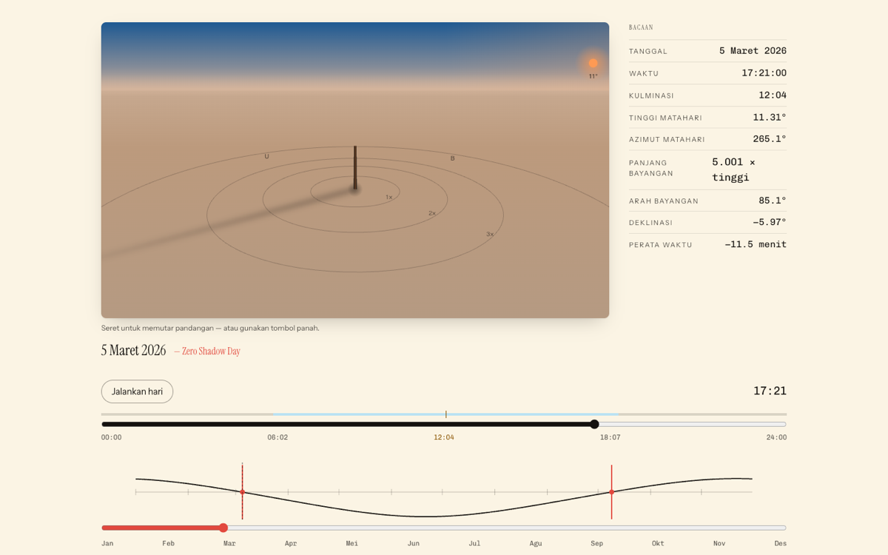
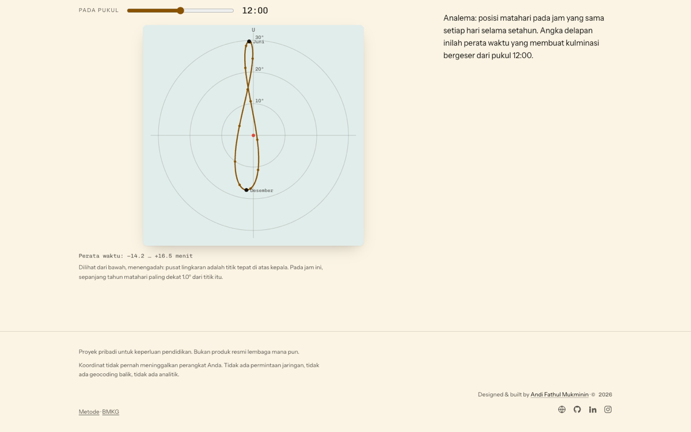
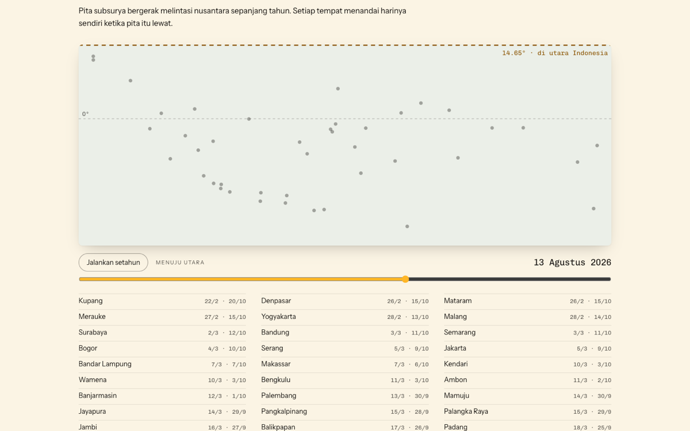

<div align="center">



**Twice a year the sun stands directly overhead and vertical things stop casting shadows.**
It only happens in the tropics, it happens everywhere in Indonesia, and almost nobody here knows it.

[**Open the site →**](https://andifathulms.github.io/zero-shadow-day/)

[](https://github.com/andifathulms/zero-shadow-day/actions/workflows/deploy.yml)


</div>

---

Everything here is computed from three numbers — **latitude, longitude, date**. There is no feed to license, no API to key, no database to keep current. It is a static site: nothing is requested after the page loads, and your coordinates never leave the browser.



## What it does

| | |
|---|---|
| **Bayangan** | A stick and its shadow in 3D, through a chosen day. Drag to walk around it; drag the date and watch the noon shadow collapse to nothing, then flip from south to north. |
| **Tanggal** | Both zero shadow days, culmination to the second, and the clock-versus-sun gap split into its two causes. Plus solar noon for any date. |
| **Kurva** | The family of shadow-tip hyperbolas — straight on the equinoxes — and the analemma, plotted looking straight up. |
| **Eratosthenes** | Partner finder, measurement flow, derived circumference, and an honest error breakdown. |
| **Sapuan** | The subsolar band crossing the archipelago through the year, each city marking on its day. |
| **Metode** | The algorithm, its stated accuracy, and what is neglected. |

Any view can be shared as a link that reproduces the exact place, date and time. Both dates export to a calendar file, and the year's culminations to a spreadsheet — built in the browser, nothing uploaded.

<table>
<tr>
<td width="50%"></td>
<td width="50%"></td>
</tr>
<tr>
<td colspan="2"></td>
</tr>
</table>

## Why it is not trivial

**A half-degree error is invisible.** The textbook sinusoidal formula for solar declination is off by up to half a degree. In the tropics that is a date several days wrong — and the output still looks entirely plausible. So the engine uses the NOAA/Meeus ch. 25 formulation (~0.01° in declination, under a minute in the equation of time for 1800–2100), and it was asserted against published values before a single pixel was drawn.

**"Zero" has a width.** The sun's disc is about half a degree across, so a real shadow shrinks to a minimum over a couple of minutes rather than vanishing. Every result carries a window, derived from the sun's apparent semi-diameter *on that day* rather than a constant, and the residual shadow is never reported as zero. Anyone with a stick could disprove an over-precise claim.

**A day is discrete; the crossing is continuous.** The declination equals your latitude at some *instant*, which may fall at 03:00. So the zero shadow day is found by minimising the culmination shadow across candidate days — not by rounding a crossing time to a date.

**Outside the tropics there is no answer**, and the app says so, naming the latitude limit — never a nearest date, never a clamp.

## Verified against BMKG

The zero shadow day fixtures are [BMKG](https://www.bmkg.go.id/)'s own published tables — *Kulminasi Utama I 2026* and *Kulminasi Utama II 2025*, 38 provincial capitals each, transcribed at BMKG's coordinates so a disagreement can only be about the astronomy.

**75 of 76 dates exact, all 76 within a day, culmination times under five seconds.**

The two disagreements are pinned down in tests rather than tolerated:

- **Pekanbaru 2026** — the app names 22 March against BMKG's 21st. The city sits 0.53° from the equator, so the crossing falls between two culminations: the noon zenith is 0.284° on the 21st and 0.111° on the 22nd, and the app's rule is the smaller residual.
- **Four rows of the 2025 table** — Jayapura, Nabire, Wamena and Merauke carry their *first* culmination's time. Their two published times differ by seconds where the equation of time demands 19–27 minutes, while Sorong and Manokwari in the same zone and table differ by exactly their EoT change. The test proves this from the equation of time rather than assuming it.

Everything else is asserted against published values too — declination at the equinox and solstice instants, the equation of time's extrema and zero crossings, and an Eratosthenes round-trip that recovers the radius its synthetic observations were generated from.

## Getting started

```bash
pnpm install
pnpm dev
```

```bash
pnpm build        # static export to ./out, with .nojekyll and the manifest
pnpm preview      # serve ./out under the production basePath
pnpm test:run     # the full suite, before every commit
pnpm test:solar   # the solar engine against published values — first in CI
pnpm typecheck
pnpm lint
```

## How it is put together

```
app/[locale]/        id (default) and en, statically exported
components/scene/    the 3D canvas renderer
lib/
  solar/             THE CORE. Pure, framework-free, extractable.
  shadow/            length + bearing. Shares no code with lib/solar.
  zsd/               the search: minimise the noon shadow over a year
  scene/             projection + a sky driven by solar altitude
  eratosthenes/      circumference and error analysis
  day/               composes the above into what the views draw
data/cities/         bundled Indonesian coordinates
tests/               solar · zsd · shadow · eratosthenes · scene · a11y · brand
```

A few rules hold the design together, and each is enforced by a test rather than by good intentions:

- **`lib/solar` imports nothing** — no framework, no DOM, no `Date`, no network — so it lifts out as a package unchanged.
- **`lib/shadow` shares no code with `lib/solar`**, so neither can validate the other's errors.
- **The shadow's drawn length is its true ratio** to the gnomon. The 3D scene works in units of gnomon heights and applies one camera transform to every point; a test measures the drawn shadow at three altitudes and proves the on-screen ratios come out 2 : 1 : 0.5.
- **Contrast ratios are asserted**, so lightening a tone fails the suite instead of shipping.

The 3D is hand-rolled — a camera and a perspective divide, about 8 KB. An engine would have cost more than the entire JavaScript budget.

## Brand assets

`exports/` holds the design source-of-truth — every icon size, tile variant, lockup and wordmark — and is **gitignored**. The subset the site serves is committed: the favicon and Apple touch icon in `app/`, and the PWA icons in `public/brand/`. Regenerating the kit means re-running that copy.

## Deployment

`main` builds and deploys to GitHub Pages via Actions. `basePath` comes from the repository name; `.nojekyll` and the web manifest are written by the build. CI runs `pnpm test:solar` on its own first, because every other number depends on it.

## Credits

A personal educational project — not an official product of any institution. **BMKG** publishes the authoritative zero shadow day announcements for Indonesian cities each year.

Designed and built by **[Andi Fathul Mukminin](https://andifathulms.github.io/en/)** · [GitHub](https://github.com/andifathulms) · [LinkedIn](https://www.linkedin.com/in/andifathulmukminin/) · [Instagram](https://www.instagram.com/andifathulms/)
